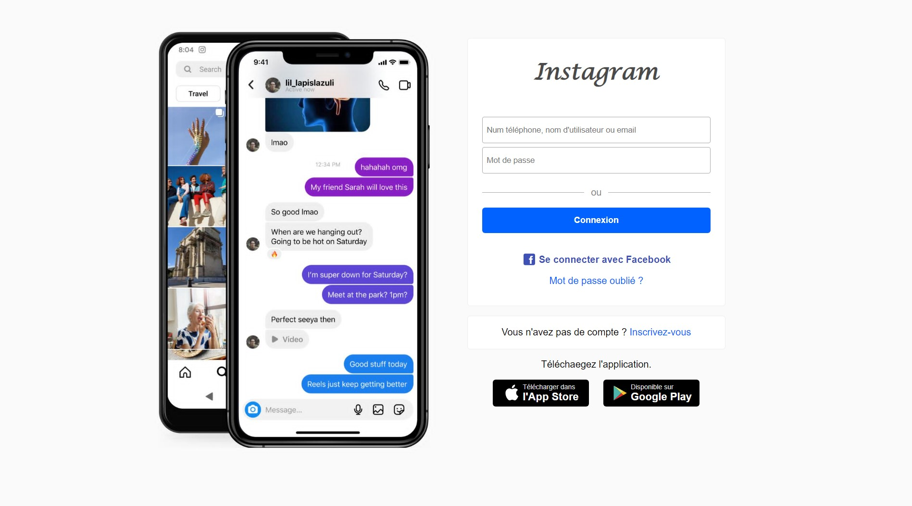

# Login page - `Instagram~clone`🚀



## Salut et Bienvenue! 👋

Ceci est le jolie clone de page de connexion fait avec SCSS

```javascript
    const Bye = (name) => {
      console.log(`👋 Bye Bye ${name}`)
    }
    
    Bye("You 👋")
```